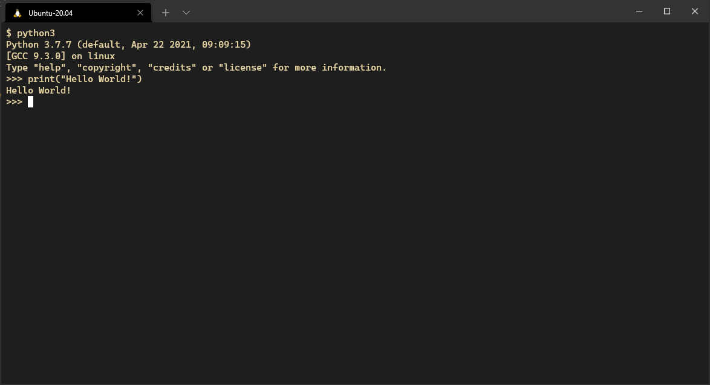
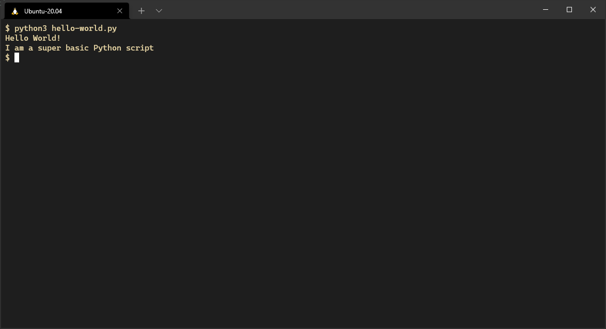

# Hello World!

In this section we'll introduce
how to run Python interactively
and via a script
using the traditional first program.

These instructions assume
you have a Python3 environment
and a suitable text editor installed.

## Running Python interactively

You can run the Python terminal
in an interactive session.
To do this open a command-line or terminal
(Powershell on Windows, zsh on MacOS, bash on Linux)
type `python3` and hit "Enter".

You should see a prompt looking like `>>>`.
To test your environment,
type `print("Hello World")`
and hit "Enter".



## Running Python scripts

You can also run Python through scripts.
A 'Python script' is a collection of commands in a file,
designed to be executed from the top-down
as a standalone program.

To try this out,
open your text editor
and create a file called "hello-world.py"
with the following contents:

``` python
print("Hello World!")
print("I am a super basic Python script")
```

Once you've done that,
open a terminal window
in the same directory
that you made your script,
then type `python3 hello-world.py`,
and hit "Enter".

You should see something like this:



## Next steps

After you've done this,
we'll go into some of the basics of Python
in [the next exercise](02-variables-and-types.md).