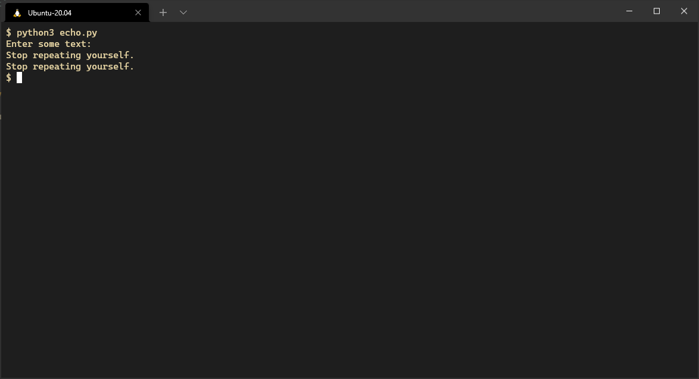

# Variables and types

In this section we'll introduce variables and basic data types,
before moving onto something more interesting.

## Echo... echo

Let's make a script that asks for a message
and writes it back to the user,
calling it "echo.py".

``` python
user_input = input("Enter some text:\n")
print(user_input)
```

If you run it you should see that it prints out what you entered.



In this script Python prompts the user for input,
stored this as a string referenced by the variable `user_input`
and printed it out.

## What's a variable?

A variable in Python is a label that points to an object.
In the above example the variable was called `user_input`
and the object it referenced was the string that the user entered
which Python saved in memory.

When the Python interpreter encountered the line `print(user_input)`
it followed the label
and printed out the string `user_input` was pointing to.

Since variables are just labels in Python,
you _can_ reuse the same name
pointing it to some other data
(but you probably shouldn't).

Try the following examples in the interpreter and see what happens:

```
>>> a = "Hello"
>>> print(a)
>>> a = 5 > 7
>>> print(a)
>>> a = 4
>>> print(a)
>>> print(a + 6)
>>> a = "This won't work"
>>> print(a + 6)
```

## Types and dynamic typing

Python infers the type of a variable
from the contents of the object assigned to it.
Python is also "strongly typed",
so it doesn't try to coerce the types of variables
to make operations work, instead failing with a `TypeError`.

All the basic types common to programming languages
are available in Python,
including
* number types such as `int`, `float`, and `complex`
* collections such as `list`, `set`, and `dict`
* boolean i.e. `True` and `False`
* `callable` - functions are objects and so have a type
* the good old `NoneType`

You can inspect the type of an object in Python
by passing it into the built in `type()` function

```
>>> type(4)
<class 'int'>
>>> type("cake")
<class 'str'>
>>> type(print)
<class 'builtin_function_or_method'>
```


## Next steps

After this we'll move onto [basic control flow](03-basic-control-flow.md).

## Further reading

### Built in types
You can read more about the built-in types offered by Python
in the [official documentation](https://docs.python.org/3/library/stdtypes.html).

### Gradual typing
Recent versions of Python have made it possible
to explicitly specify the types of variables
so that code can be checked for type-correctness
by static analysis tools.

For example the following code declares a function
that repeats a given string a specified number of times

``` python
def repeat(text: str, times: int) -> str:
    result: str = text * times
    return result
```

You can read the [mypy documentation](https://mypy.readthedocs.io/en/stable/introduction.html)
to see how to use this in practice.